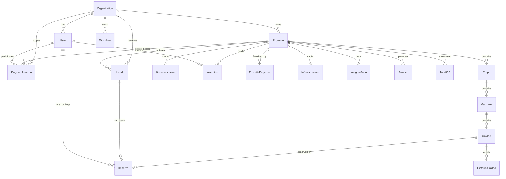

# Data Model

This document maps the main Seventoop data model verified from `prisma/schema.prisma` and current code paths. It complements [[multi-tenancy]], [[roles-and-permissions]], [`../modules/projects.md`](../modules/projects.md), and [`../modules/units-and-inventory.md`](../modules/units-and-inventory.md).

## Core Hierarchy

Confirmed core chain: `Organization -> Proyecto -> Etapa -> Manzana -> Unidad`.

Some records carry `orgId` directly. Others inherit tenant context through a parent:

- Direct tenant field: `User.orgId`, `Proyecto.orgId`, `ProyectoUsuario.orgId`, `Lead.orgId`, `Workflow.orgId`, `Banner.orgId`.
- Inherited tenant field: `Etapa`, `Manzana`, `Unidad`, `Reserva`, `Inversion`, `Documentacion`, `Tour360`, `Infraestructura`, and `ImagenMapa` resolve organization through `Proyecto` or through the hierarchy.

## Core Entities

### Organization

Purpose: tenant anchor.

- PK: `id`.
- Important fields: `nombre`, unique `slug`, legacy/string `plan`, optional `planId`.
- Relations: users, projects, project relations, leads, workflows, LogicToop, banners, integration configs, pipeline stages.
- Tenant field: self.
- Indexes: `planId`.
- Soft delete: none.

### User

Purpose: authenticated actor and participant in projects, CRM, reservations, investments, and admin flows.

- PK: `id`.
- Unique fields: `email`, `passwordResetToken`, `googleId`.
- Tenant field: optional `orgId`.
- Role field: `rol`, default `CLIENTE`.
- Important state fields: `kycStatus`, `demoEndsAt`, `demoUsed`, `riskLevel`, `developerVerified`.
- Relations: created projects, project relations, assigned leads, investments, reservations as seller/buyer, notifications, documents.
- Indexes: `orgId`.
- Soft delete: none.

### Proyecto

Purpose: central real-estate/product entity. It owns inventory, public landing data, validation flags, investment settings, CRM linkage, media, and operational relationships.

- PK: `id`.
- Unique fields: nullable unique `slug`.
- Tenant field: optional `orgId`.
- Creator field: `creadoPorId`.
- Status fields: `estado`, `visibilityStatus`, `estadoValidacion`, `documentacionEstado`.
- Operational flags: `puedePublicarse`, `puedeReservarse`, `puedeCaptarLeads`.
- Soft delete field: `deletedAt`.
- Important indexes: `estado`, `estadoValidacion`, `createdAt`, `visibilityStatus`, `isDemo`, `tipo`, `orgId`.
- Major relations: `Etapa`, `ProyectoUsuario`, `Lead`, `Oportunidad`, `Reserva` through `Unidad`, `Inversion`, `Documentacion`, `ProyectoImagen`, `Infraestructura`, `ImagenMapa`, `Tour360`, `Banner`, `ProyectoEstadoLog`, `Pago`, `Tarea`, `Testimonio`.
- Cascade/onDelete: many child tables delete with the project, including `Etapa`, `ProyectoImagen`, `Documentacion`, `EscrowMilestone`, `PriceHistory`, `ProyectoUsuario`, `ProyectoEstadoLog`, `Infraestructura`, `ImagenMapa`, and `Tour360`.

### ProyectoUsuario

Purpose: relation-based project ownership and collaboration model.

- PK: `id`.
- Unique: `[proyectoId, userId]`.
- Tenant field: required `orgId`.
- Relation type: `tipoRelacion` enum: `OWNER`, `VENDEDOR_ASIGNADO`, `COMERCIALIZADOR_EXCLUSIVO`, `COMERCIALIZADOR_NO_EXCLUSIVO`, `COLABORADOR`, `SOLO_LECTURA`.
- Relation state: `estadoRelacion` enum: `ACTIVA`, `PENDIENTE`, `RECHAZADA`, `VENCIDA`.
- Permission flags: edit project, upload documentation, see global leads, see global metrics.
- Mandate fields: `tipoMandato`, mandate document URL, validity dates, admin approval fields.
- Indexes: `proyectoId`, `userId`, `orgId`, `[tipoRelacion, estadoRelacion]`.
- Cascade/onDelete: deleting project or user deletes relation rows.

### Etapa

Purpose: first inventory grouping under project.

- PK: `id`.
- Parent: required `proyectoId`.
- Status field: `estado`, default `PENDIENTE`.
- Ordering: `orden`.
- Tenant: inherited through `Proyecto`.
- Indexes: `proyectoId`.
- Cascade/onDelete: deleting project deletes etapas; deleting etapa deletes manzanas through relation cascade.

### Manzana

Purpose: second inventory grouping under stage/block.

- PK: `id`.
- Parent: required `etapaId`.
- Data fields: `nombre`, `coordenadas`.
- Tenant: inherited through `Etapa -> Proyecto`.
- Indexes: `etapaId`.
- Cascade/onDelete: deleting etapa deletes manzanas; deleting manzana deletes unidades.

### Unidad

Purpose: sellable/reservable inventory item.

- PK: `id`.
- Parent: required `manzanaId`.
- State field: `estado`, default `DISPONIBLE`.
- Commercial fields: `precio`, `moneda`, `financiacion`, dimensions, orientation.
- Media/map fields: `coordenadasMasterplan`, `imagenes`, `tour360Url`, `polygon`, `centerLat`, `centerLng`.
- Assignment field: optional `responsableId`.
- Tenant: inherited through `Manzana -> Etapa -> Proyecto`.
- Indexes: `manzanaId`, `estado`, `responsableId`, `[manzanaId, estado]`.
- Cascade/onDelete: deleting manzana deletes unidades; deleting unidad cascades reservation/history dependencies where configured.

## Project-Adjacent Entities

| Entity | Relationship to project | Purpose / behavior |
|---|---|---|
| `ProyectoImagen` | `proyectoId`, cascade | Professional project gallery. `esPrincipal` can update `Proyecto.imagenPortada`. |
| `Documentacion` | optional `proyectoId`, cascade | Project/user documentation; status defaults to `PENDIENTE`. |
| `Reserva` | through `Unidad`; optional `Lead` | Reservation lifecycle for units. Tenant resolved through unit -> project. |
| `Inversion` | `proyectoId`, cascade | Investor purchase/funding intent; increments `m2VendidosInversores` when confirmed. |
| `Lead` | optional `proyectoId`, optional `orgId` | CRM lead. Creation paths should resolve org or quarantine to `LeadIntake`. |
| `FavoritoProyecto` | `proyectoId`, cascade | User favorites; unique `[userId, proyectoId]`. |
| `Infraestructura` | `proyectoId`, cascade | Map/infrastructure overlays and progress. |
| `ImagenMapa` | `proyectoId`, optional `unidadId`, cascade on project | Geolocated images for project maps. |
| `Banner` | optional `projectId`, optional `orgId` | Promotional content; can be global/org/project-contextual. |
| `Tour360` | `proyectoId`, optional `unidadId`, cascade on project | 360 showcases with scenes and hotspots. |
| `Workflow` | direct `orgId`, not project-linked | Native workflow automation is org-scoped rather than project-scoped. |
| `ProyectoEstadoLog` | `proyectoId`, cascade | Validation state transition history and flags snapshot. |
| `PriceHistory` | `proyectoId`, cascade | Project price changes. |
| `Pago` | optional `proyectoId` | Payment records; no cascade from project in schema. |
| `Tarea` / `Oportunidad` | optional/direct project relation | CRM tasks and opportunities tied to leads/projects/units. |

## Confirmed Access Anchors

- Project management permissions resolve through `getProjectAccess`.
- `requireProjectOwnership(projectId)` requires auth and `EDITAR_PROYECTO` permission, with admin/superadmin bypass.
- Public project reads use `buildPublicProjectWhere()` and `isProjectPubliclyVisible()` in the newer public adapters.
- API middleware lets `/api/*` through; API routes must guard themselves.
- There is no Prisma tenant middleware or database row-level security in the repository.

## Inconsistencies And Gaps

- `Proyecto.deletedAt` exists and public/developer queries often filter it, but `deleteProyecto` and `/api/developments/[id]` currently hard-delete via `prisma.proyecto.delete`.
- `Proyecto.visibilityStatus` defaults to `PUBLICADO`, and `createProyecto` also sets `PUBLICADO` even when `estadoValidacion` starts as `BORRADOR`. Public visibility still depends on multiple filters and demo expiry.
- Two creation surfaces exist: guarded Server Action `createProyecto` with KYC/demo, slug, validation flags, OWNER relation, and audit; API routes `/api/proyectos` and `/api/developments` create a simpler project without the same state-machine setup.
- `lib/validations/proyectos.ts` and `lib/validations/unidades.ts` are stubs; active schemas are inline in actions/routes.
- Some actions use input field names such as `coordsGeoJSON`, while Prisma models use `coordenadas` or `coordenadasMasterplan`.
- `WorkflowRun` stores `entityId` only; this is tracked in [`../../TECH_DEBT.md`](../../TECH_DEBT.md) as observability/extensibility debt after runtime tenant enforcement.

## Sources

- [`../../prisma/schema.prisma`](../../prisma/schema.prisma)
- [`../../lib/guards.ts`](../../lib/guards.ts)
- [`../../lib/project-access/get-project-access.ts`](../../lib/project-access/get-project-access.ts)
- [`../../lib/public-projects.ts`](../../lib/public-projects.ts)
- [`../../lib/project-landing/adapter.ts`](../../lib/project-landing/adapter.ts)
- [`../../lib/project-showcase.ts`](../../lib/project-showcase.ts)
- [`multi-tenancy.md`](multi-tenancy.md)
